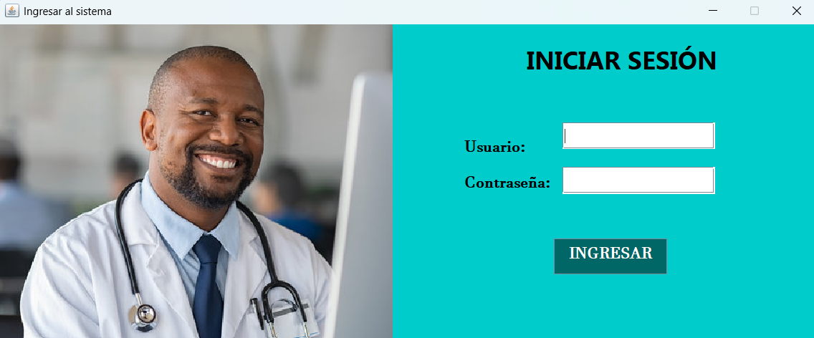
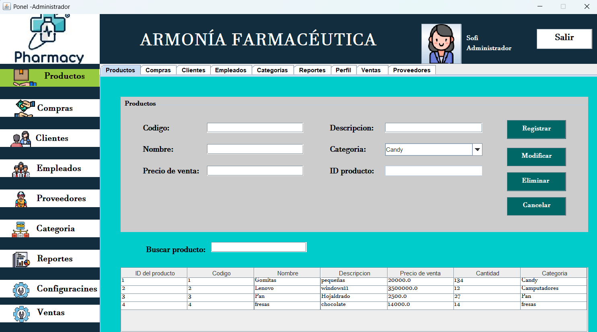
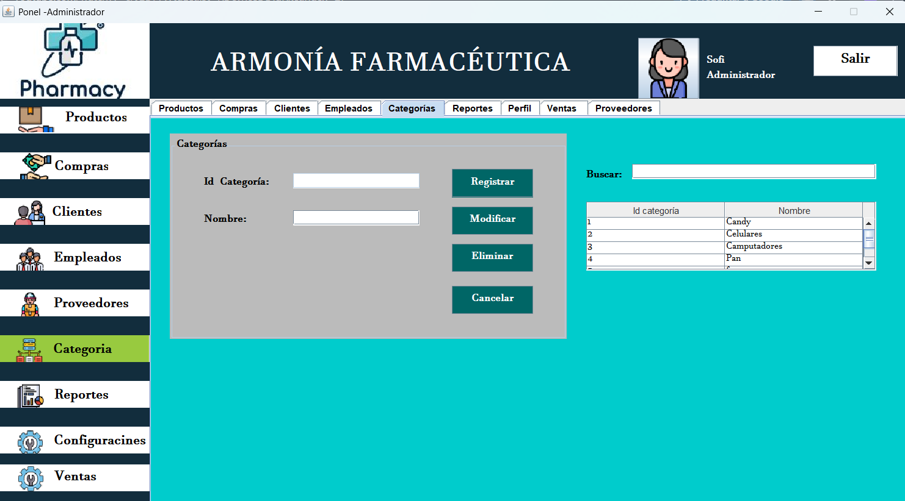
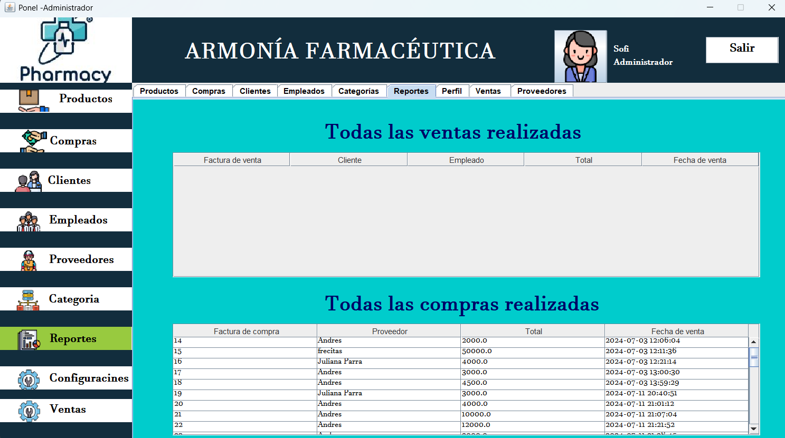
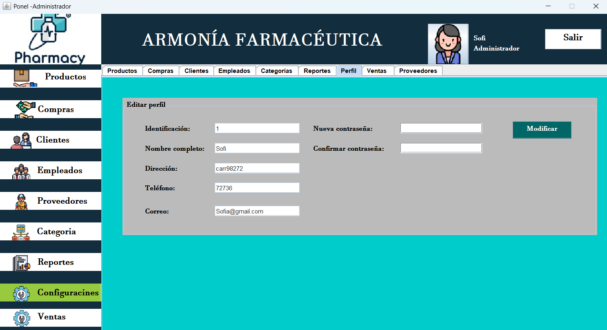

<div align="center">

# Pharmacy Management System

A desktop application developed in Java to streamline pharmacy operations by managing products, suppliers, purchases, and invoice generation through an intuitive graphical interface.

[🇺🇸 English](README.md) | [🇪🇸 Español](README.es.md)

</div>

---

## 📖 About the Project

The Pharmacy Management System is a desktop application developed in Java to simplify the administration of a pharmacy. It provides an organized interface for managing products, suppliers, purchases, and automatically generating invoices based on purchase transactions.

The project follows the MVC (Model–View–Controller) architectural pattern and implements a layered structure using DAOs to separate business logic, data access, and the user interface.

This project is part of my software development portfolio and demonstrates my experience building desktop applications with Java and relational databases.

---

## ✨ Features

- 💊 Product management.
- 🚚 Supplier management.
- 🛒 Purchase registration.
- 🧾 Automatic invoice generation.
- 💰 Colombian currency formatting.
- 📦 Purchase detail management.
- 🔍 Search and administration of records.
- 🖥 Desktop graphical interface built with Java Swing.

---

## 🛠 Technologies

- Java
- Java Swing
- JDBC
- MySQL
- MySQL Workbench
- NetBeans IDE

---

## 📸 Screenshots

### 🏠 Login



---

### 💊 Product Management



---

### 🚚 Category



---

### 🧾 Reports



---

### 👤 Profile configuration




## 🚀 Installation

### Clone the repository

```bash

https://github.com/Karen908/FarmaciaJava.git
```

### Open the project

Open the project using **NetBeans IDE**.

### Configure the database

- Create the MySQL database.
- Import the provided SQL script.
- Update the database connection credentials if necessary.

### Run the application

Compile and run the project from NetBeans.

---

## 📚 What I Learned

During the development of this project, I strengthened my knowledge in:

- Desktop application development with Java Swing.
- MVC architecture implementation.
- DAO pattern for data access.
- CRUD operations.
- Relational database design.
- Database connectivity using JDBC.
- Business logic implementation.
- Invoice generation.
- Colombian currency formatting.
- Code organization and maintainability.

---

## 🎯 Project Goal

The goal of this project was to develop a desktop application capable of managing the daily operations of a pharmacy by centralizing product, supplier, purchase, and invoice management in a single system.

---

## 👩‍💻 Author

**Karen Daniela Pérez Parra**

Feel free to explore the project and connect with me through my portfolio or LinkedIn.
